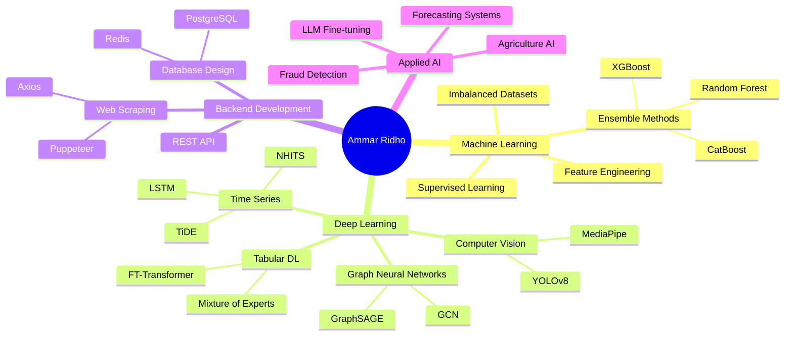

<div align="center">

# 🌌 Muhammad Ammar Ridho

### `ML/AI Engineer` • `Backend Developer` • `Data Science Enthusiast`

[](https://portofolio-ammar-smoky.vercel.app)
[](mailto:jhenerar21@gmail.com)
[](https://linkedin.com/in/ammar-ridho)

```ascii
╔═══════════════════════════════════════════════════════════════╗
║  🎓 Data Science Student @ Telkom University                  ║
║  🏆 1st Place - Kaggle Data Slayer 2025                       ║
║  🥈 Finalist - GEMASTIK XVIII Data Mining                     ║
║  🚀 Focused on LLM, Applied AI & Scalable ML Systems          ║
╚═══════════════════════════════════════════════════════════════╝
```

</div>

---

## 🧠 About Me

```python
class AmmarRidho:
    def __init__(self):
        self.name = "Muhammad Ammar Ridho"
        self.role = "ML/AI Engineer & Backend Developer"
        self.location = "Bandung, Indonesia"
        self.education = "Data Science @ Telkom University"
        self.interests = ["Large Language Models", "Applied AI", "Tabular Deep Learning"]
        
    def current_focus(self):
        return {
            "learning": ["LLM Fine-tuning", "Mixture of Experts", "Graph Neural Networks"],
            "building": ["AI-powered Solutions", "Scalable ML Pipelines", "Web Scraping Tools"],
            "exploring": ["FT-Transformer", "Advanced Feature Engineering", "System Design"]
        }
    
    def mindset(self):
        return "Deep understanding > Shortcuts | Fundamentals matter | Applied AI for impact"
```

---

## 🏆 Achievements & Competitions

<div align="center">

| 🥇 Achievement | 🏢 Organization | 📅 Year |
|:--------------|:----------------|:--------|
| **🥇 1st Place** - Kaggle Data Slayer 2025 | Telkom University Purwokerto | 2025 |
| **🥈 Finalist** - GEMASTIK XVIII Data Mining | Kemendikbudristek | 2025 |
| **🥉 10th Place** - Kaggle Datavidia Competition | HMIF ITB | 2025 |
| **🏅 3rd Place** - ADIKARA Data Mining Competition | PRODIGI & FIF Telkom | 2024 |
| **🎖️ Finalist** - Olimpiade Jaringan Mikrotik Nasional | Citraweb Solusi Teknologi | 2023 |

</div>

---

## 💻 Tech Stack

### 🔥 Core Languages


### 🤖 Machine Learning & AI


### 🌐 Backend & Web Development


### 🗄️ Databases & Infrastructure


### 🛠️ Tools & Platforms


---

## 🚀 Expertise Areas



---

## 📊 GitHub Statistics

<div align="center">


</div>

---

## 💼 Professional Experience

### 🎯 Current Roles

**🔬 Person In Charge - Data Mining Competition** @ PRODIGI  
`May 2025 - Present`
- Leading Data Mining Division, mentoring talents in AI Innovation & Data Analytics
- Building community for knowledge sharing: competitions, courses, workshops
- Designing programs for competitive skill development

**🕷️ Web Scraping R&D** @ Central Computer Improvement  
`April 2025 - Present`
- Developing scraping solutions for social media (Instagram, Facebook) using TypeScript
- Implementing session handling with Puppeteer, Axios, Fetch API
- Optimizing crawling pipelines for scalable performance

---

## 🎓 Notable Projects

### 🥇 Video Analysis Pipeline - Kaggle Data Slayer 2025
**Tech:** MediaPipe • YOLOv8 • XGBoost • Random Forest • CatBoost
- Landmark-based feature extraction (face, hand, pose)
- Engineered geometric ratios (MAR, EAR, Hand Aspect Ratio)
- Temporal frame aggregation with ensemble modeling
- **Result:** 🏆 1st Place on Leaderboard

### 🛡️ Fraud Detection System - GEMASTIK XVIII
**Tech:** Graph Convolutional Networks • XGBoost • CatBoost
- Hybrid GCN + ensemble learning for P2P lending fraud detection
- Handled imbalanced, large-scale financial datasets
- **Result:** AUC Score 0.8330, outperforming GraphSAGE & TGN baselines

### 📈 Food Price Forecasting - Datavidia Competition
**Tech:** NHITS • NBEATSx • LSTM • TiDE • TSMixerx
- Forecasting daily prices for 13 commodities across 34 provinces
- Integrated exogenous features and evaluated multiple neural architectures
- **Result:** 🥉 10th Place on Leaderboard

### 🌾 Multivariate Price Index Forecasting - ADIKARA
**Tech:** CNN • LSTM • Hybrid Architecture
- Developed CNN-LSTM hybrid for multivariate food price indices
- Cross-country forecasting with deep learning
- **Result:** 🏅 3rd Place

---

## 🌱 Research Interests

```yaml
Focus Areas:
  - Large Language Models:
      - Local fine-tuning with limited resources
      - Practical LLM applications
      - Efficient inference strategies
  
  - Advanced Tabular Deep Learning:
      - FT-Transformer for structured data
      - Mixture of Experts (MoE) architectures
      - Handling missing feature subsets
  
  - Applied AI Solutions:
      - Agriculture: Crop recommendation, soil analysis
      - Education: AI-powered learning tools
      - Community-based AI solutions
  
  - System Design:
      - Scalable ML pipelines
      - Distributed systems
      - Database architecture optimization
```

---

## 📜 Certifications

🎓 **MTCRE** - MikroTik Certified Routing Engineer  
🎓 **MTCNA** - MikroTik Certified Network Associate

---

## 🎯 Current Learning Path

```diff
+ 🔥 LLM Fine-tuning on MacBook Air M1
+ 🧠 Advanced Graph Neural Networks
+ 🚀 Mixture of Experts (MoE) Architecture
+ ⚡ System Design for ML at Scale
+ 🌐 Distributed ML Systems
```

---

## 💡 Philosophy

> **"Deep understanding over shortcuts. Fundamentals matter. Build AI that creates real impact."**

I believe in:
- 🎯 **Applied AI** - Solutions that solve real-world problems
- 🧠 **Fundamental Knowledge** - Understanding the "why", not just the "how"
- 🚀 **Continuous Learning** - Always exploring cutting-edge techniques
- 🤝 **Community Impact** - Building AI for social good

---

## 📫 Let's Connect!

<div align="center">

[](https://portofolio-ammar-smoky.vercel.app)
[](mailto:jhenerar21@gmail.com)
[](https://linkedin.com/in/ammar-ridho)

### 💬 Open to collaborate on:
**ML/AI Projects** • **Backend Development** • **Research Opportunities** • **Open Source Contributions**

</div>

---

<div align="center">

### ⚡ Fun Fact
```python
while True:
    learn_new_things()
    build_cool_projects()
    share_knowledge()
    # repeat until AGI 🤖
```


**✨ "Building the future, one model at a time" ✨**

</div>
