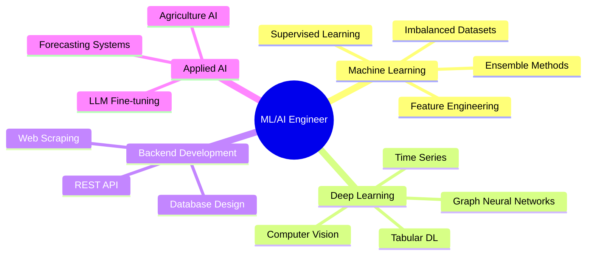

<div align="center">

# 🌌 Muhammad Ammar Ridho

### `ML/AI Engineer` • `Backend Developer` • `Data Science Enthusiast`

[](https://portofolio-ammar-smoky.vercel.app)
[](mailto:jhenerar21@gmail.com)
[](https://linkedin.com/in/ammar-ridho)

```ascii
╔═══════════════════════════════════════════════════════════════╗
║  🎓 Data Science Student @ Telkom University                  ║
║  🚀 Focused on LLM, Applied AI & Scalable ML Systems          ║
╚═══════════════════════════════════════════════════════════════╝
```

</div>

---

## 🧠 About Me

```python
class AmmarRidho:
    def __init__(self):
        self.role = "ML/AI Engineer & Backend Developer"
        self.location = "Bandung, Indonesia"
        self.education = "Data Science @ Telkom University"
        self.focus = ["Large Language Models", "Applied AI", "Tabular Deep Learning"]
        
    def current_work(self):
        return {
            "learning": ["LLM Fine-tuning", "Mixture of Experts", "Graph Neural Networks"],
            "building": ["AI Solutions", "ML Pipelines", "Web Scraping Tools"],
            "exploring": ["FT-Transformer", "Advanced Feature Engineering"]
        }
```

> **"Deep understanding over shortcuts. Build AI that creates real impact."**

---

## 💻 Tech Stack

### Languages & Core


### Machine Learning & AI


### Backend & Web


### Database & Tools


---

## 🚀 Expertise



---

## 📊 GitHub Stats

<div align="center">


</div>

---

## 💼 Current Roles

**🔬 PIC Data Mining Competition** @ PRODIGI `May 2025 - Present`  
Leading Data Mining Division, mentoring talents in AI Innovation & Data Analytics

**🕷️ Web Scraping R&D** @ Central Computer Improvement `April 2025 - Present`  
Developing scraping solutions using TypeScript, Puppeteer, and optimizing crawling pipelines

---

## 🌱 Research Interests

- **Large Language Models**: Local fine-tuning, practical applications, efficient inference
- **Tabular Deep Learning**: FT-Transformer, Mixture of Experts, handling missing features
- **Applied AI**: Agriculture solutions, education tools, community-based AI
- **System Design**: Scalable ML pipelines, distributed systems

---

## 📫 Let's Connect!

<div align="center">

[](https://portofolio-ammar-smoky.vercel.app)
[](mailto:jhenerar21@gmail.com)

**Open to collaborate on ML/AI Projects • Backend Development • Research Opportunities**


</div>
